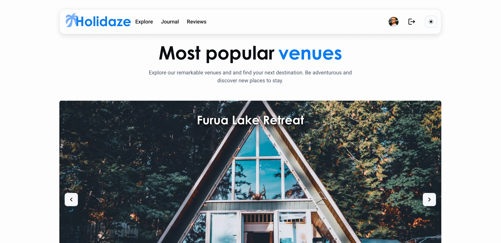
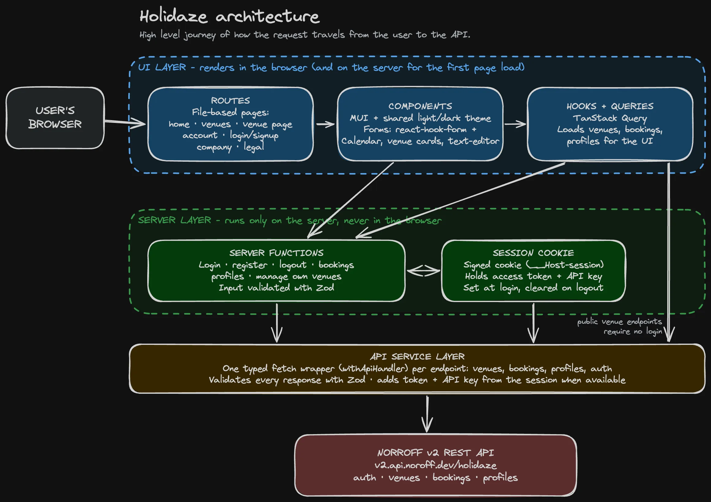

# Holidaze

A venue booking system where users can browse and book venues, manage their venues and bookings.<br/>


**Author:** Tele Caster Nilsen<br/>
**Live site:** https://holidaze.telecasternilsen.com

---

**Table of Contents**

- [Introduction](#introduction)
- [Technologies](#technologies)
- [Architecture](#architecture)
- [Installation](#installation)
- [Deployment](#deployment)
- [Session Management](#session_management)
- [Application Weaknesses](#application-weaknesses)
- [AI Usage](#ai_usage)
- [Resources](#resources)

## Introduction

This project is my exams project at Noroff School of Technology and Digital Media. For the project brief provided by the school for this exam, see [here](DOCS/BRIEF.md).<br/>
**Link to Github projects:** [kanban/gant](https://github.com/users/telecasteren/projects/5)<br/>
**Link to Github repository:** [repo](https://github.com/telecasteren/holidaze)

## Technologies

- React
- TypeScript
- TanStack Start
- MUI
- Zod
- Noroff v2 REST API

### Misc

- react-hot-toast
- react-hook-form
- react-aria-components (RangeCalendar)
- TipTap (text-editor)

## Architecture

High level illustration:



## Installation

Clone the repository

```bash
git clone https://github.com/telecasternilsen/holidaze.git
```

Navigate to the project directory

```bash
cd holidaze
```

Install dependencies and run the app

```bash
pnpm install
pnpm dev
```

Build this app for production

```bash
pnpm build
```

### Deployment

This app is deployed on [Netlify](https://www.netlify.com).<br/>
**Live site:** [holidaze](https://holidaze.telecasternilsen.com)
<br/>

**Linting & Formatting**

This project uses [eslint](https://eslint.org/) and [prettier](https://prettier.io/) for linting and formatting. Eslint is configured using [tanstack/eslint-config](https://tanstack.com/config/latest/docs/eslint). The following scripts are available:

```bash
pnpm lint
pnpm format
pnpm check
```

**console.logs**

I've added a lint rule that flags any `console` logs used around the codebase, so I remember to clean it up before shipping to production. However, if needed during development, this can easily be ignored for a line by adding the following comment above the `console` log:

```bash
/* eslint-disable-next-line no-console */
```

The API calls and Zod schemas have all been labeled as well, so a cool way to see whats what when developing is adding this log to `handler.ts`:

```bash
# debugging API endpoints (below `resolvedInit` block)
console.log(`[${label ?? "unlabeled"}] →`, resolvedEndpoint);

# debugging schema parsing (inside "if (!parsedPayload.success)" block)
console.log(
  `[${label ?? "unlabeled"}] → ${schema.description ?? "unamed schema"}\n` +
    z.prettifyError(parsedPayload.error),
);
```

NB: Needs the `label` passed as a param though.

### Session Management

This app uses a cookie-based session management system, utilizing the TanStack Cookie Store. Server functions can be found here: [src/server/](src/server/session.ts).

All authentication logic is handled server-side. That means that all authenticated endpoints require a valid session cookie, and must be called from the server, never from the client. See example invoked from the server: [profileFunctions](src/server/profileFunctions.ts), then served to the client: [profilesQuery](src/lib/queries/profilesQuery.ts).

## Testing

Unit tests [here](tests/units) | E2E tests [here](tests/e2e)

```bash
pnpm test # runs all unit tests
pnpm test booking # runs single unit test (booking.test.ts)

pnpm test:e2e # runs all e2e tests
pnpm test:e2e booking # runs single e2e test (booking.spec.ts)
```

You can stress test by adding `repeat` flag

```bash
pnpm exec playwright test booking --repeat-each=5
```

---

### Application Weaknesses

#### Mocked features

> **Venues: toggling favorites**<br/>
> Currently, it only tracks the state of added/removed favorites client side. This is because the API does not support persistent storage of favorites. Hence, this feature is purely visual.

> **Login: Forgot password route**<br/>
> Purely visual, no `password reset` logic implemented.

> **Login: Remember me**<br/>
> Purely visual, no `remember me` logic implemented.

> **Reviews:**<br/>
> Purely mock-data to show how reviews are displayed, because the API does not serve reviews per venues. Clicking a review will redirect to venues list page.

> **Notifications:**<br/>
> Purely mock-data to visualize in-app notifications. Clicking a notification link will remove the "unread dot" (in memory only, e.g. does not survive page refresh).

ℹ️ **For known issues and warnings see** [ISSUES/WARNINGS](DOCS/ISSUES.md)

---

## AI Usage

In this project, AI can be used to:

- Brainstorming, wireframe and initial architectural discussions
- Explaining concepts / rubberducking
- Generating some boilerplate / scaffolding
- Drafting initial documentation and JSDocs

_All AI usage is logged and can be found in [AI_LOG.md](DOCS/AI_LOG.md)._

### Resources

- Material UI documentation and template: [Marketing page](https://mui.com/material-ui/getting-started/templates/)
- Material UI [createTheme and colors](https://mui.com/material-ui/customization/color/)
- Material UI [colour system](https://m2.material.io/design/color/the-color-system.html#tools-for-picking-colors)
- TanStack Start [docs](https://tanstack.com/start/latest/docs/framework/react/getting-started)
- TanStack search params [docs](https://tanstack.com/router/latest/docs/guide/search-params)
- MUI breakpoints [docs](https://mui.com/material-ui/customization/breakpoints/)
- MUI Pagination [docs](https://mui.com/material-ui/react-pagination/)
- React Avatar and `stringAvatar` [docs](https://mui.com/material-ui/react-avatar/)
- Authentication service [docs](https://www.robinwieruch.de/how-to-roll-your-own-auth/)
- TanStack cookie store and server fn [docs](https://tanstack.com/start/latest/docs/framework/react/guide/authentication-server-primitives)
- TanStack beforeLoad / loader [docs](https://github.com/TanStack/router/discussions/1949)
- TanStack stripSearchParams [docs](https://tanstack.com/router/latest/docs/api/router/stripSearchParamsFunction)
- Untitled UI Range Calendar [docs](https://www.untitledui.com/react/components/date-pickers)
- Controller and useForm [docs](https://react-hook-form.com/docs/usecontroller/controller)
- StackOverflow: handle negative numbers (TextField) [docs](https://stackoverflow.com/questions/77828960/negative-value-of-mui-textfield-type-number-on-xiaomi)
- Format dates [docs](https://stackoverflow.com/questions/3552461/how-do-i-format-a-date-in-javascript)
- mui-tiptap RichTextEditor [docs](https://www.npmjs.com/package/mui-tiptap)
- Tiptap editor [docs](https://tiptap.dev/docs/editor/getting-started/style-editor)
- React forwardRef, useImperativeHandle [docs](https://react.dev/reference/react/useImperativeHandle)
- DOMPurify [docs](https://www.npmjs.com/package/isomorphic-dompurify)
- dangerouslySetInnerHTML [docs](https://dev.to/hijazi313/using-dangerouslysetinnerhtml-safely-in-react-and-nextjs-production-systems-115n)
- Zod empty states (void/undefined) [docs](https://didoesdigital.com/blog/zod-type-parsing-functions/)
- TanStack useMutation [docs](https://tanstack.com/query/latest/docs/framework/react/reference/functions/useMutation)
- React Hook Form [docs](https://react-hook-form.com/docs/useform/handlesubmit)
- React lazy Suspense [docs](https://react.dev/reference/react/lazy)
- Netlify plugin features [docs](https://npmx.dev/package/@netlify/vite-plugin)
- sitemap.xml [docs](https://digital.gov/resources/introduction-xml-sitemaps)
- Geolocation API [docs](https://developer.mozilla.org/en-US/docs/Web/API/Geolocation_API/Using_the_Geolocation_API)
- Popover popupState [docs](https://github.com/jcoreio/material-ui-popup-state)
- Error statuses [docs](https://developer.mozilla.org/en-US/docs/Web/HTTP/Reference/Status/400)
- eslint no-console [docs](https://eslint.org/docs/latest/rules/no-console)
- Typescript serialization [docs](https://hackernoon.com/mastering-type-safe-json-serialization-in-typescript)
- [Excalidraw](https://excalidraw.com)
- MUI X Charts [docs](https://mui.com/x/react-charts/bars/)
- MUI X Charts styling [docs](https://mui.com/x/react-charts/styling/#colors)
- Playwright [docs](https://playwright.dev/docs/intro#installing-playwright)
- Vitest [docs](https://vitest.dev/guide/)
- MUI DatePicker [docs](https://mui.com/x/react-date-pickers/)
- Noroff API Holidaze [docs](https://docs.noroff.dev/docs/v2/holidaze)
- Noroff API Swagger [docs](https://v2.api.noroff.dev/docs/static/index.html#/holidaze-profiles)

## Acknowledgements

FONT FAMILY

- Century Gothic [font](https://online-fonts.com/fonts/century-gothic)

UNSPLASH IMAGES

Thanks to [Luthi Alfarezi](https://unsplash.com/@luthfialfarizi) for the 'Reviews' avatars.
